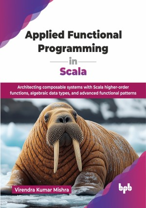

# Applied Functional Programming in Scala

Architecting composable systems with Scala higher-order functions, algebraic data types, and advanced functional patterns.

This is the repository for [Applied Functional Programming in Scala
](https://bpbonline.com/products/applied-functional-programming-in-scala?variant=44705382269128),published by BPB Publications.

## About the Book
Functional programming is transforming how we build robust, scalable, and maintainable software by prioritizing clarity and predictability. It emphasizes what to compute by defining expressions that map values to other values, and focuses on how to achieve a result through a sequence of statements that change program state.

This book explores core functional principles like immutability, pure functions, and referential transparency. You will gain a deep understanding of the mathematical underpinnings through category theory concepts like Functors and Monads, and then apply these practically using Scala functional features and leading libraries such as Cats and ZIO. The book also covers handling effects and I/O, advanced functional patterns, and using specialized tools to build functional web, database, and streaming solutions. With real examples and patterns, it shows how these ideas can simplify code, improve testability, and increase system resilience.

By the end of this book, you will have a theoretical understanding and practical proficiency in building high-quality, maintainable applications using functional programming in Scala.

## What You Will Learn
• Implement Scala higher-order functions, currying, and Option/Either.

• Understand Functors, Monads, and their category theory relevance.

• Utilize Cats type classes for extensible functional programming.

• Build scalable applications using FP patterns.

• Manage side-effects and I/O functionally using effect systems.

• Real-world use of functional programming.
